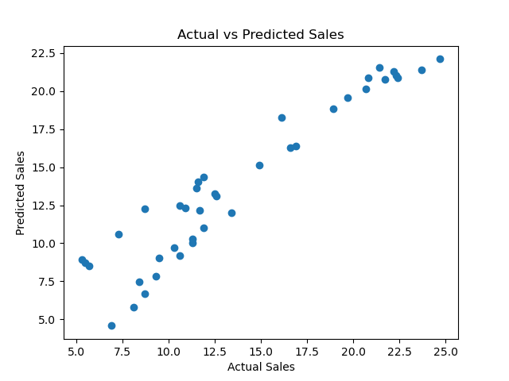

 Sales Prediction using Python

## Overview
This project builds a Machine Learning regression model to predict future sales based on advertising expenditures across different channels (TV, Radio, Newspaper).

## Tech Stack
- Python
- Pandas & NumPy (Data Processing)
- Matplotlib & Seaborn (Data Visualization)
- Scikit-learn (Model Building & Evaluation)

## Results & Outputs
- **Model**: Linear Regression
- **MAE**: 1.27
- **MSE**: 2.90
- **RMSE**: 1.70
- **R² Score**: 0.89

### Actual vs Predicted Plot

## Key Insights & Business Strategy
- TV and Radio advertising budgets show the strongest positive impact on driving sales numbers.
- Newspaper spend shows minimal return, suggesting marketing budget should be redirected primarily to TV and Radio.